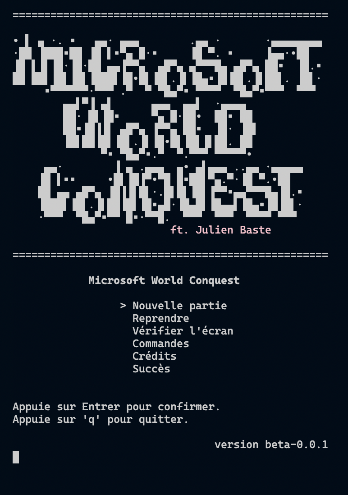
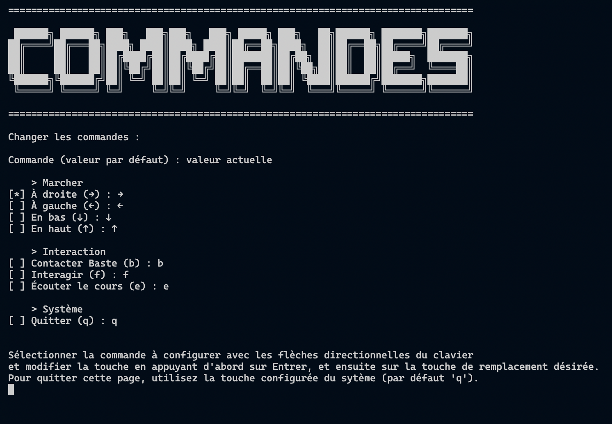
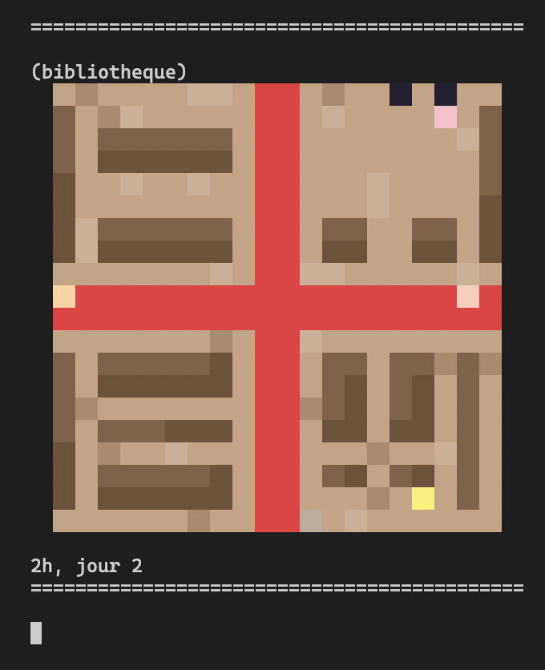

# Microsoft World Conquest Game

Un RPG unique en son genre qui se joue dans le terminal ! Il s'agit d'un projet d'école, intitulé "Saé 1.2" codé avec un langage de programmation customisé : `iJava` (plus une contrainte qu'autre chose).

> **NOTE**: Le code source de iJava (.jar) est présent dans [lib](./lib)

## Equipe

- Thomas GYSEMANS ([CodoPixel](https://github.com/CodoPixel/))
- Manon LECLERCQ ([tuturmann](https://github.com/tuturmann))

## Description du jeu

Le jeu débute sur une carte nommée "bibliotheque". Vous incarnez un pixel dans un monde dystopique en 2D où le monopole de Microsoft s'apparente à une conquête mondiale. Il s'agit de l'ennemi et votre but sera de collecter des informations avec l'aide de votre professeur préféré rencontré dans la bibliothèque (J.B). Cependant, Microsoft essaie d'éliminer les gens qui ne croient pas en eux, alors vous serez kidnappé(e) et enfermé(e) dans une sorte de prison censée vous laver le cerveau.

La quête principale est de sortir de la prison en emmenant JB avec vous, et au passage les autres membres de l'organisation rebelle. Collectez des informations auprès des autres prisonniers, trouvez des secrets cachés dans les cartes du jeu et apprenez des choses durant les cours de lavage de cerveau. Pour réussir, vous devrez regrouper des codes secrets et hacker discrètement le système informatique du centre via des commandes BASH (des commandes qui vous permettent de contrôler un ordinateur) que JB vous expliquera à la perfection.

_Le jeu est rempli d'easter eggs (de surprises qui ne sont pas en rapport avec l'histoire) et c'est à vous de les trouver !_

_Temps de jeu moyen : 30 minutes._

## Comment débuter le jeu

Ce jeu se joue dans le Terminal, alors vous devez d'abord l'ouvrir, puis enfin entrer les deux commandes suivantes dans l'ordre :

```bash
./compile.sh
./play.sh
```

Si votre Terminal n'autorise pas l'exécution, alors entrez la commande suivante avant, puis réessayez :

```bash
chmod +x ./compile.sh ./play.sh
```



Il y a plusieurs options dans le menu principal. Dans un premier temps, nous vous recommandons de jeter un œil à `Vérifier l'écran`. Cette section vous permet de vérifier si votre Terminal est suffisamment grand pour jouer normalement. Il est très important de vérifier cela, au risque d'être confronté à des soucis d'affichage imprévisibles. Pensez à **réduire la taille de la police d'écriture** du Terminal, si possible. Notez que ce programme vérifie uniquement la hauteur de l'écran. Assurez-vous que votre écran soit relativement large.

Une autre page intéressante du jeu, que vous devriez consulter avant de commencer à jouer, est intitulée `Commandes`. Cette dernière vous permet de personnaliser les touches. Par défaut, vous vous déplacerez à l'aide des flèches directionnelles du clavier, mais certains joueurs préfèrent généralement utiliser la combinaison `Z, Q, S, D` ou `Z, A, S, D`. Suivez les instructions indiquées pour modifier les raccourcis si vous le désirez.



Le temps de la version bêta, vous incarnerez un pixel rose (`#ffccbb`) tout du long de votre aventure. Vous débutez dans la première salle du jeu : la bibliothèque, où vous rencontrez JB. Le jeu se base sur l'exploration et très peu d'indications vous seront données. Interagissez avec les PNJ (personnages non-joueur) et trouvez votre chemin.



L'heure et le jour de votre partie sont affichés en-dessous de la carte active. Sachez qu'il y a un temps limité pour accéder à la victoire. Vous débutez votre aventure le vendredi 1er août, et aurez 30 jours pour vous évader.

En parallèle de votre quête principale, qui vous sera expliquée par J.B, vous devrez agir normalement dans la prison et assister aux cours qui auront lieu le mardi, le jeudi, le samedi et le dimanche. Pour le moment, aucune pénalité n'est infligée si vous n'y assistez pas, mais il est prévu que cela change.

Enfin, gardez en tête que vous pouvez sauvegarder votre partie pour la reprendre plus tard, ou en démarrer une nouvelle à tout moment. Cependant, dans cette version bêta, **une seule et unique sauvegarde** n'est possible en simultané. Ainsi, si vous sauvegardez une partie, quittez pour en jouer une autre et sauvegardez la nouvelle, alors la précédente sauvegarde sera effacée définitivement.

## But pédagogique

L'accent a été mis sur l'apprentissage de quelques commandes BASH rudimentaires et l'exploration d'un ordinateur. Le but est de comprendre ce qu'est un fichier, un dossier, comment le tout est organisé et comment il peut être manipulé.

Le jeu met à disposition un **interpréteur Bash custom**. Il diffère sur quelques points techniques par rapport au vrai Bash, mais est suffisant pour ce jeu.

En parallèle, des cours sont mis à disposition avec quelques bases en anglais, français et histoire, ainsi que des petits problèmes de maths à resoudre. Tous les cours se composent d'une leçon puis d'une question à choix multiple dont le but est de vérifier la compréhension de ladite leçon.

## Risques d'incompatibilité

> **ATTENTION** : certains terminaux ne sont pas compatibles avec ANSI.

Nous vous conseillons fortement d'utiliser le Terminal intégré de **[Visual Studio Code](https://code.visualstudio.com/)**. Il est important de noter que Visual Studio Code n'est pas identique à Codium, car ce dernier affiche une représentation ASCII des caractères entrés dans le terminal courant, alors qu'il ne devrait pas. Un patch rapide a été appliqué donc ça n'est pas un problème.

Le terminal de IntelliJ IDEA n'est pas idéal, et dans le terminal par défaut d'un Mac les couleurs ne s'affichent même pas.

## Explications techniques

> **IMPORTANT**: Le code est compréhensible pour tout programmeur expérimenté, mais il est extrêmement complexe dans la mesure où beaucoup de bricolage a dû être réalisé pour contourner les restrictions imposées et les problèmes qu'iJava impose. Afin de simplifier la compréhension du code source d'environ **3500 lignes**, retrouvez ici une explication détaillée de toutes ses fonctionnalités majeures.

## Notre interpréteur Bash

Notez que l'interpréteur Bash a été entièrement écrit en `Java`. En raison des contraintes de développement imposées sous le prétexte "on l'a pas vu, donc tu sais pas", le réaliser en iJava aurait été particulièrement energivore et chronophage.

Ainsi, les fichiers suivants ne pas à prendre en compte :

- `Path.java`
- `Element.java`
- `FileElement.java`
- `BashCommand.java`
- `BashError.java`
- `BashResult.java`
- `BashReader.java`

### Organisation du code

Le code principal se trouve dans `Main.java`. Nous utilisons les types suivants :

- `Map` : une carte.
- `Color` : une couleur possible des cartes.
- `Page` : une page parmi tant d'autres (car il y a un menu, une page de crédits, une page pour jouer etc.).
- `TVInfo` : une information diffusée par la télévision de la cellule du joueur.
- `Command` : une commande, un raccourci.
- `CommandCategory` : une catégorie de raccourcis.
- `Credit` : un élément de la page des crédits.
- `Dialog` : le message d'un dialogue entre le joueur et un PNJ suite à une interaction.
- `Help` : l'aide de J.B (qui fait office de narrateur du jeu pour guider le joueur).
- `Lesson` : un cours.
- `Secret` : un secret du jeu, à trouver pour le finir.

### Fonctionnement des cartes

Nous affichons dans le Terminal des cartes colorées. Pour réaliser cela, nous utilisons les normes [ANSI](https://www.ansi.org/) qui permettent, entre autres, de contrôler le curseur du Terminal et de colorer du texte.

Nous considérons **deux espaces** comme étant **un pixel**, d'où les constantes précisées ci-dessous. Avoir deux espaces comme étant un pixel nous permet d'avoir une forme carrée pour ceux-ci (un seul espace blanc est un rectangle, deux espaces blancs forment un carré - du moins à l'oeil nu).

```java
final String PIXEL = "  "; 
final int PIXEL_SIZE = length(PIXEL);
```

Le pixel est affiché et le fond est coloré. Nous avons accès à 16 millions de couleurs différentes, dans un premier temps au format RGB et dans un deuxième temps converties au format ANSI lors de l'initialisation des données.

* Comment convertir du RGB en ANSI ? Voici le format :

```java
"\u001b[<p>;2;<r>;<g>;<b>m"
```

où 

- `<p>` est soit 38 (pour colorer le texte), soit 48 (pour colorer le fond).
- `<r>` la composante rouge du format RGB
- `<g>` la composante verte du format RGB
- `<b>` la composante bleue du format RGB

Il suffit d'écrire ceci dans le terminal et tout ce qui suit se colore tel que précisé. Si l'on veut colorer une seule partie d'un texte par exemple, on termine la sélection avec `\u001b[0m` ce qui redonne à la suite le format par défaut.

> **NOTE**: il est possible d'afficher une couleur transparente (la même que celle du terminal) avec `\u001b[49m`

À l'aide d'une matrice où chaque élément est la couleur d'un pixel, nous sommes capables d'afficher tout ce dont nous avons besoin.

> **NOTE** : Nous utilisons `-1` pour une couleur transparente.

### Initialisation

En premier lieu, comment le jeu s'initialise-t-il ? Dans le dossier [assets](./assets) se trouvent de nombreux fichiers au format `CSV` ou `txt`.

#### Valeurs par défaut

Les fichiers CSV précédés d'un `0-` sont soit des constantes utilisées pour charger le jeu correctement, soit des valeurs par défaut que le joueur pourra customiser plus tard. Nous avons, en particulier :

- `0-colors.csv`

Ce fichier est appelé la **charte de couleurs**. Celui-ci répertorie l'ensemble des couleurs utilisées dans le jeu. Elles ont toutes un numéro unique et une couleur RGB associée.

Ce fichier est complexe et la façon dont nous exploitons les couleurs est très particulière. Puisque chaque pixel représente quelque chose de spécifique, nous devons attribuer des métadonnées à celles-ci. En effet, une couleur peut représenter une table, de l'eau, un mur etc. Et puisque le joueur se déplace dans la carte, il ne doit pas pouvoir marcher sur ces éléments ! Et oui, le joueur ne peut pas marcher sur l'eau !

Les couleurs peuvent avoir plusieurs métadonnées :

- `x` : un booléan qui précise si le joueur peut marcher (_franchir_) le pixel ou non.
- `t` : un booléan qui précise si ce pixel est une passerelle vers une autre carte. En effet, la vue du joueur se porte sur la salle dans laquelle il se trouve et se déplace. Il est important qu'il puisse explorer l'intégralité des scènes mises à disposition. Par conséquent, certains pixels, si l'utilisateur applique le mouvement correct (vers le haut, vers la droite, vers le bas ou vers la gauche), permettent la "téléportation" vers une autre carte. Tout est précisé dans `0-teleportations.csv`. Avec ceci nous précisons les données suivantes :
  - `toMap` : la map cible
  - `movX` : le déplacement sur l'axe X (-1 ou 1)
  - `movY` : le déplacement sur l'axe Y (-1 ou 1)
  - `targetX` : la position cible sur l'axe X dans la map cible
  - `targetY` : la position cible sur l'axe Y dans la map cible
- `i` : un booléan qui précise si la couleur est interactive. On sait si la couleur est interactive en lisant le fichier `0-dialogs.csv`.

#### Les cartes

Chaque carte est une matrice où chaque élément est le numéro unique d'une couleur définie dans la charte. En apparence, ces fichiers semblent illisibiles et difficiles à comprendre. Bien évidemment, nous n'avons pas rédigé ça à la main, Thomas a conçu un site permettant de dessiner les cartes puis ensuite de générer la charte (`0-colors.csv`), les cartes (`./assets/maps/*`) et les téléportations (`0-teleportations.csv`) : [2dmapcreator](https://2dmapcreator.sciencesky.fr/) avec système de connexion à un compte client pour travailler sur plusieurs machines (via Firebase). Le code est disponible en public sur [GitHub](https://github.com/CodoPixel/2dmapcreator).

Les cartes, ainsi que les autres fichiers CSV, sont initialisés une seule et unique fois au lancement du programme, sauf à la réinitialisation des données quand le joueur veut démarrer une nouvelle partie. C'est pour le moment nécessaire car, lors de l'évasion (la fin du jeu), on doit supprimer quelques couleurs et on ne peut les retrouver. Il va falloir modifier ce comportement dans une future version.

### Les autres éléments graphiques

Nous utilisons également des formes en ASCII qui font principalement office de titres pour nos pages. Tous ces fichiers seront dans le dossier `./assets/ascii`.

### Le temps

Afin d'avoir un système de jour et de nuit, ainsi qu'un calendrier, nous avons dû créé un Thread séparé qui incrémente, à un délai fixe, le temps.

Il est essentiel d'avoir un Thread séparé pour un comportement asynchrone, c'est-à-dire non bloquant. Le joueur peut se mouvoir et en parallèle le code responsable de faire passer le temps continue.

### Gestion des mouvements

ANSI nous permet de positionner le curseur à l'aide d'un système de **coordonnées**. Lorsque l'on veut écrire quelque chose à une position donnée, nous calculons les coordonnées de la position cible et écrivons le contenu à cet endroit, avant de remettre le curseur à sa position initiale.

C'est selon cet algorithme qu'à chaque déplacement du joueur, le programme place, très rapidement, le curseur à la position actuelle du joueur, écris la couleur en-dessous de lui (celle de la map), puis décale vers la position cible pour réécrire le pixel avec la couleur donnée du joueur (qui pour l'instant est de couleur `#ffccbb`).

On replace le curseur à une position précise sous l'interface afin d'éviter d'avoir constamment un rectangle blanc à côté du joueur (le curseur).

iJava nous permet de capturer les touches saisies par l'utilisateur en direct (on capture l'événement) ce qui est bien plus ergonomique.

[Plus d'informations sur ANSI ici](https://tldp.org/HOWTO/Bash-Prompt-HOWTO/x361.html).

### Difficultés techniques rencontrées et patchs appliqués

Nous développons avec deux contraintes majeures :

- iJava et ses limitations
- Les limitations imposées par les professeurs (`ArrayList` nous manque).

Même si iJava nous donne déjà de nombreux outils très utiles à notre programme, nous avons rencontré des soucis avec celui-ci :

- Nous avons dû redéfinir la méthode `println`. Tout est expliqué dans les commentaires du code, mais en bref la façon dont iJava capture en direct les touches sur lesquelles l'utilisateur appuie a engendré des comportements inattendus tel que le [staircase effect](https://unix.stackexchange.com/questions/366423/unexpected-indentation-behaviour-when-i-set-the-terminal-to-raw-mode-why-is-th/366426).
- Nous avons également dû redéfinir `clearScreen`, car elle ne faisait pas ce qu'elle est censée faire pour des raisons inconnues. Cette méthode est censée effacer le contenu du terminal, certes, mais surtout **remettre le curseur à la position (0;0)**. Le problème est qu'avec cette méthode seule, il arrivait que le curseur ne soit pas exactement positionné au bon endroit, et par conséquent tous les calculs de coordonnées étaient erronés, causant des problèmes très particuliers, étranges et inattendus. Nous avons solutionné le problème en forçant le curseur à la position 0 avec la méthode `clearMyScreen`.
- La méthode `loadCSV` ne renvoie pas l'erreur si le fichier n'existe pas... et au lieu de ça iJava l'affiche via un `println`. Cependant, avec `newFile`, iJava catch l'erreur pour en renvoyer une d'un autre type... Bon du coup pour vérifier si un fichier existe c'est très particulier...
- La méthode `saveCSV` avec délimiteur custom ne fonctionne pas. Il y a appel récursif infini provoquant une `StackOverflowError`. On ne la donc pas utilisé.

Enfin, nous aurions aimé utiliser **Java** pour ses fonctionnalités :(.

## Optimisations

Beaucoup d'optimisations pourraient se faire :

- Changer le fonctionnement des dialogues avec message unique pour éviter le spam.
- Supprimer la première colonne de la charte des couleurs (le fichier CSV).
- Utilisez d'autres fonctionnalités ANSI pour le changement de la position du joueur.
- Alléger le fichier des téléportations pour d'une part concevoir un algorithme qui prédit dans **les deux sens** la téléportation dans une map précise à des coordonnées précisées, et d'autre part représenter le mouvement avec un seul chiffre plutôt que deux (puisque le joueur ne peut se déplacer en diagonale).

Cependant, vu qu'on utilise iJava en plus des restrictions de fonctionnalités, et bien "optimiser" n'a pas forcément d'intérêt.

## Tests

Puisque le jeu se base à 90% sur de l'événementiel, il est difficile de réaliser des tests unitaires. Quelques tests sont toutefois possibles pour certaines fonctions de traitement des chaines de caractères et des fichiers  et sont à la fin du code source.

## Futur du jeu

Quelques fonctionnalités sont prévues :

- Utiliser du vrai Java
- Pénalité si absence aux cours
- Gardes qui surveillent la prison la nuit
- Succès (achievements).

## Remerciements

Merci beaucoup à toute la team, aux profs qui ont aidé et merci à JB pour nous laisser utiliser son nom dans le jeu.